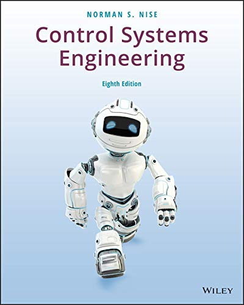

# Blog
I am a student from the University of Queensland. In this blog, I'll be posting some of my notes for METR4201 control engineering.

  

## Note:
### Lecture
- Week1: Single-input / Single-output system(SISO)
- Week2: Linearity and Superposition
- Week3: Laplace Transform
- Week4: Modelling
- Week5: Modelling system with gears

### Mid-sem
- [Random notes](midsem.md)
